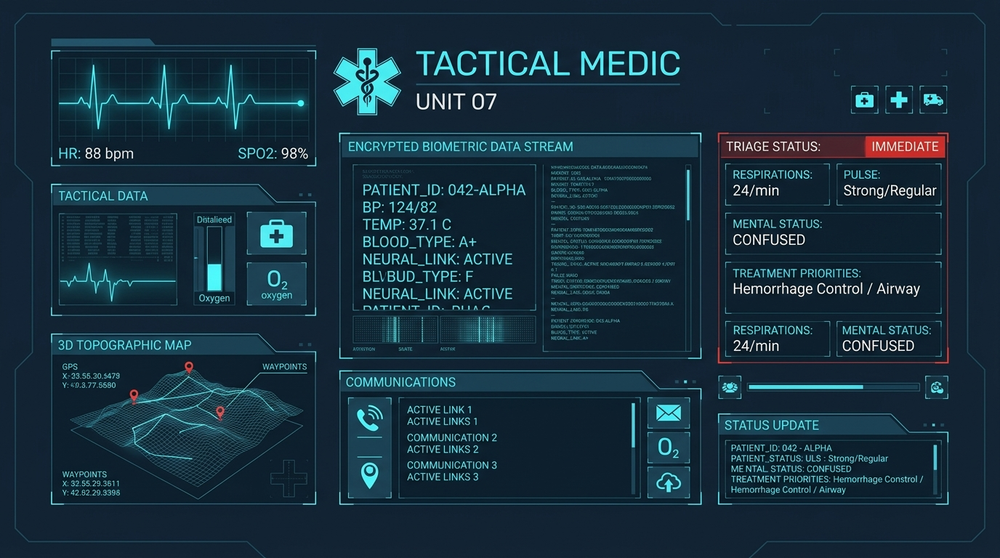

# MedRescue — Emergency Tactical Medical Response & Encrypted Health Telemetry

MedRescue is an offline-first, mission-critical emergency medical companion designed for rapid SOS dispatch, local AES-256 encrypted Room database health profiling, first responder scannable QR triage passes, and step-by-step clinical first aid protocols.

---

## Key Capabilities & Architecture

1. **SOS Telemetry Dispatch Console**
   - 2-second press-and-hold tactile armed dispatch trigger to prevent accidental activation.
   - 5-stage automated dispatch protocol: GPS lock, encrypted health bundle assembly, nearest Level-1 trauma center locator, paramedic channel transmission, and live ER intake telemetry streaming.
   - Abort dispatch confirmation dialog with visual status indicators.

2. **Secure Room Database Schema & Cryptographic AES-256 Encryption**
   - **Persistence Layer**: Jetpack Room Database (`AppDatabase`) with SQLite backend (`medrescue_secure_health.db`).
   - **Encryption at Rest**: AES-256 GCM (Galois/Counter Mode) authenticated encryption with fresh cryptographic IVs.
   - **Tamper-Evident Hashing**: SHA-256 integrity signatures computed across health records to detect unauthorized alterations.
   - **Reactive Repository**: Kotlin Coroutines `Flow` streams with auto-decryption on query and automatic key derivation.

3. **First Responder Scannable QR Pass**
   - High-contrast, scannable QR code canvas containing signed patient triage payload.
   - Toggle between Standard Triage Payload and Raw FHIR-compatible JSON tokens.
   - Quick visual badges for Blood Type, Organ Donor status, Resuscitation Code, Allergies, and In-Case-of-Emergency (ICE) direct phone dialer.

4. **Trauma Center ER Directory & Radar**
   - Real-time radius scanning of Level 1, 2, and 3 emergency trauma centers.
   - Dynamic ETA calculation across Walking, Driving, and Priority Ambulance response modes.
   - Tactical circular radar map view with animated sweep beam and interactive facility markers.

---

## Database Schema (`AppDatabase`)

### `EncryptedHealthEntity` (`encrypted_health_records`)
| Field Name | Type | Description |
|---|---|---|
| `id` | `String` (PK) | Primary key identifier (`PRIMARY_HEALTH_PROFILE`) |
| `fullNameEncrypted` | `String` | Base64 AES-256-GCM ciphertext of patient full name |
| `dobEncrypted` | `String` | Base64 AES-256-GCM ciphertext of Date of Birth |
| `bloodTypeEncrypted` | `String` | Base64 AES-256-GCM ciphertext of blood type (e.g. `O+`, `A-`) |
| `pronounsEncrypted` | `String` | Base64 AES-256-GCM ciphertext of patient pronouns |
| `organDonor` | `Boolean` | Organ donor registry flag |
| `allergiesJsonEncrypted` | `String` | Encrypted list of severe allergies and respiratory conditions |
| `allergyNoteEncrypted` | `String` | Encrypted clinical allergy notes |
| `medicationsJsonEncrypted` | `String` | Encrypted active prescription medications |
| `emergencyContactNameEncrypted` | `String` | Encrypted ICE contact name |
| `emergencyContactRelationshipEncrypted` | `String` | Encrypted ICE relationship (e.g. `PARTNER`, `PARENT`) |
| `emergencyContactPhoneEncrypted` | `String` | Encrypted emergency phone number |
| `primaryPhysicianEncrypted` | `String` | Encrypted primary physician and clinic |
| `medicalNotesEncrypted` | `String` | Encrypted clinical notes and prior trauma history |
| `cryptoIv` | `String` | Base64 initialization vector used for GCM mode |
| `dataSignatureHash` | `String` | SHA-256 tamper-evident integrity hash |
| `lastUpdatedTimestamp` | `Long` | Epoch timestamp of last profile synchronization |

### `IncidentEntity` (`incident_records`)
| Field Name | Type | Description |
|---|---|---|
| `id` | `String` (PK) | Unique incident ID (e.g. `INC-2026-0818-0941`) |
| `timestamp` | `String` | UTC timestamp of dispatch |
| `status` | `String` | `IDLE`, `ARMING`, `DISPATCHED`, `RESOLVED`, `CANCELLED` |
| `locationLabel` | `String` | Selected location preset or GPS fix |
| `coordinates` | `String` | Geodetic coordinates (`Lat°N, Lng°W`) |
| `assignedUnit` | `String` | Assigned paramedic unit callsign |
| `targetFacility` | `String` | Destination trauma hospital |
| `telemetryHash` | `String` | Cryptographic transmission hash |
| `stagesCompleted` | `Int` | Completed dispatch protocol steps (1–5) |
| `createdEpochMs` | `Long` | Chronological sorting index |

---

## Emergency Health & Clinical First Aid Instructions

> ⚠️ **CRITICAL WARNING**: In any life-threatening situation, **call 911 (or your local emergency number)** immediately before or during first aid administration.

### 1. Adult CPR & Chest Compressions (Cardiac Arrest)
- **Rate & Cadence**: Compress at **100–120 BPM** (Use the built-in 110 BPM visual metronome in the First Aid module).
- **Depth**: Compress at least **2 inches (5 cm)** into the lower half of the breastbone; allow full chest recoil between compressions.
- **Ratio**: Perform **30 compressions followed by 2 rescue breaths** (if trained), or maintain continuous **Hands-Only CPR** until AED arrives or paramedics take over.

### 2. Severe Bleeding & Tourniquet (Stop The Bleed)
- **Direct Pressure**: Apply immediate, continuous, firm pressure with clean gauze/cloth directly over the hemorrhage site.
- **Wound Packing**: For deep cavity or junctional bleeding, pack gauze tightly into the depth of the wound and hold firm pressure.
- **Tourniquet Application**: For uncontrolled extremity bleeding, place a commercial Tourniquet **2–3 inches above the wound** (never directly on a joint). Tighten the windlass until bright red spurting ceases and distal pulse vanishes. Lock the windlass and record the application time (`T: HH:MM`) clearly.

### 3. Anaphylaxis & Epinephrine Auto-Injector (EpiPen)
- **Symptoms**: Facial/lip edema, wheezing, throat tightness, severe hives, dizziness.
- **Administration**:
  1. Grasp auto-injector with blue safety release pointing **UP** and orange needle tip pointing **DOWN**.
  2. Remove the blue safety cap with a straight pull.
  3. Push the orange tip firmly into the **outer mid-thigh** at a 90° angle until a loud click sounds.
  4. Hold firmly in place for **3 full seconds**, then remove and massage the injection site for 10 seconds. Call 911 immediately.

### 4. Choking & Airway Obstruction (Heimlich Maneuver)
- **Conscious Adult**: Stand behind the patient, wrap arms around the waist. Make a fist with thumb side just above the navel and grasp it with your other hand. Deliver quick, inward and upward abdominal thrusts until the airway clears.
- **Unresponsive**: Lower safely to the ground, call 911, and immediately start CPR chest compressions. Look inside the mouth for the object before each breath.

### 5. Acute Stroke — F.A.S.T. Assessment
- **F (Face Drooping)**: Ask person to smile; check if one side droops or feels numb.
- **A (Arm Weakness)**: Ask person to raise both arms; check if one arm drifts downward.
- **S (Speech Difficulty)**: Ask person to repeat a simple phrase; check for slurring or garbled speech.
- **T (Time to Call 911)**: Call 911 immediately upon noticing any single symptom and record the exact time of symptom onset.

### 6. Convulsive Seizure Protocol
- Gently ease the patient to the floor and clear all surrounding hard, sharp, or hazardous objects.
- Turn the patient into the **Recovery Position** on their side to maintain open airway drainage.
- Place a soft cushion or folded clothing under their head.
- **NEVER** hold the patient down or place anything into their mouth. Time the seizure duration and call 911 if convulsions exceed 5 minutes.

---

## Tech Stack

- **UI Framework**: Jetpack Compose with Material 3 Design & Dark Tactical HUD palette (`Slate950`, `Slate900`, `TelemetryCyan`, `SignalRed`, `SignalAmber`, `SignalGreen`).
- **Architecture**: MVVM (Model-View-ViewModel) with Kotlin Coroutines & `StateFlow`.
- **Database**: Android Jetpack Room with Kotlin Symbol Processing (`KSP`).
- **Cryptography**: AES-256 GCM authenticated encryption + SHA-256 digest hashing.
- **Testing**: Robolectric local JVM testing and Roborazzi screenshot verification.
